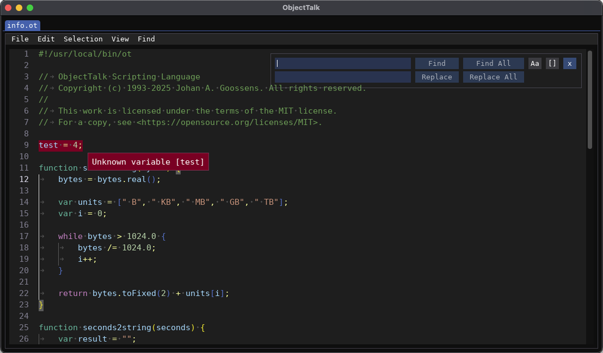

# About this fork

ImGuiTextEdit was originally developed by [Balázs Jákó](https://github.com/BalazsJako/ImGuiColorTextEdit) but he apparently
no longer has time to work on the project. In fact, the last update to his repository was in June 2019. As a result, over 200
forks exist by people who like his work but want to fix bugs and/or add new features.

A fork by [Santiago](https://github.com/santaclose/ImGuiColorTextEdit), also known as santaclose, was the most actively
maintained version (over 220 commits ahead of the original version) and this repository is a fork of it.
Following is a list of differences between this fork and the one by Santiago:

- Works with latest Dear ImGui version (currently v1.91.5) and does not use deprecated functions.
- Ability to specify custom syntax highlighting for other languages is restored.
- Ability to have custom palettes is restored.
- Ability to have error markers is restored.
- Ability to choose (at compile time) between boost::regex and std::regex (the latter makes this repository dependency free).
- Provides auto complete for paired glyphs (\[, \{, \(, \", \') (can be turned on and off).
- If auto complete is turned on, accidentally typed closing glyphs are ignored.
- If auto complete is turned on, selections can be surrounded by paired glyphs.
- Supports blinking cursor (can be turned on/off using ImGui's global io.ConfigInputTextCursorBlink flag).
- Allows bracket matching to be turned on and off.
- Adds language definition for [Markdown](https://www.markdownguide.org/basic-syntax/). Contributed by [UnidayStudio](https://github.com/BalazsJako/ImGuiColorTextEdit/issues/155).
- Allows ImGuiTextEdit instantiation before ImGui context is initialized.
- Enhanced API to support external find/replace functionality.
- Search also has the option to search for whole words.

Within reason, all efforts are made to stay in sync with Santiago's fork.

Note: In the screenshot above, the tabs, menubar and floating find/replace window are not part of the text editor.
They are part of a custom enclosing IDE. By not putting those things in the editor, integrators have maximum
flexibility to wrap the editor in their context in the way they see fit. The public API to externally implement
these features is however included.

## License

This work is licensed under the terms of the MIT license.
For a copy, see <https://opensource.org/licenses/MIT>.
